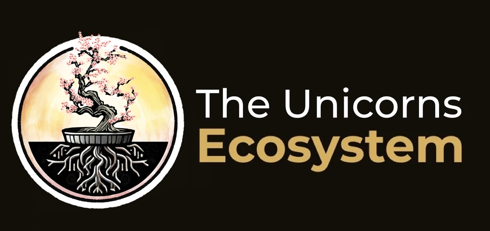
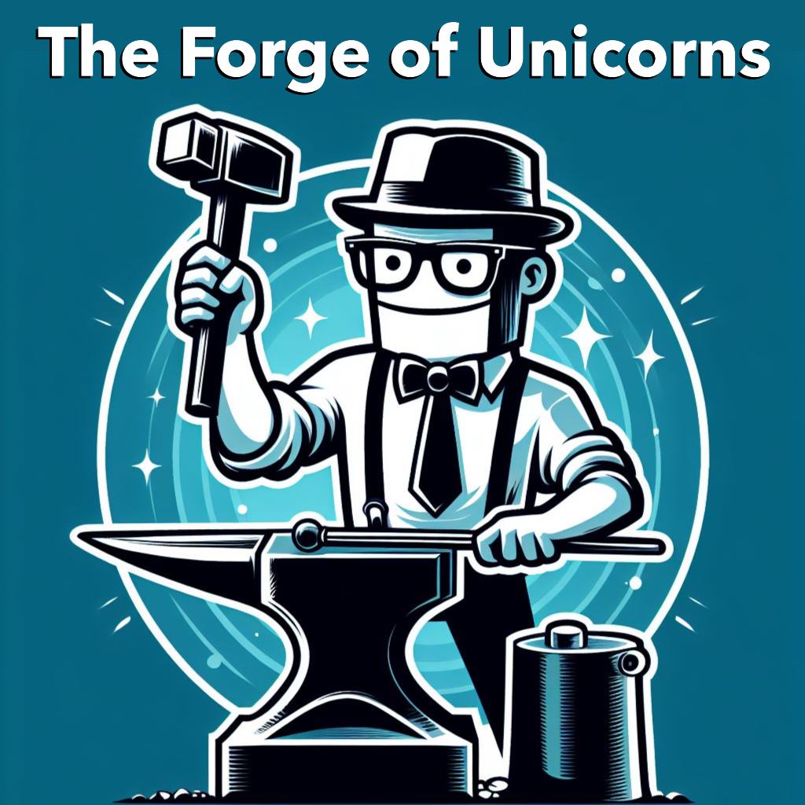
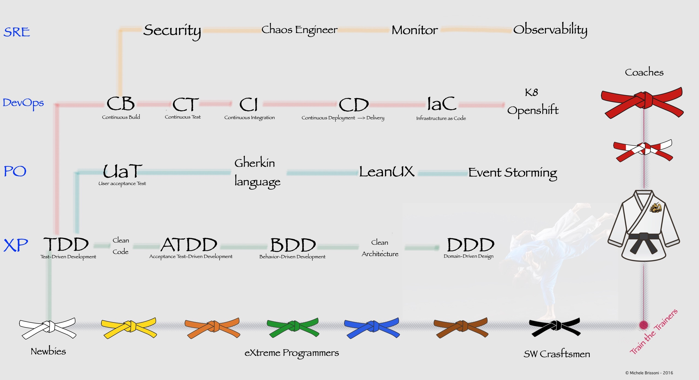

# Michele Brissoni — Helping PE/VC & CTOs Forge High-Performing Unicorns 🦄🚀
## [CEO @ BriX Consulting — The Forge of Unicorns](https://brix.consulting/)

## ⚠️ The Brutal Truth About Digital Investments

If you’re here, chances are you’re facing the same hard truths killing digital organizations:

- 🧱 **Underperforming software teams** draining cash instead of compounding value.
- 🔥 **Tech debt** blocking growth and suffocating your roadmap.
- 💸 **Investments bleeding money** while delivery keeps missing the mark.

And it gets worse...

- 🤖 **GenAI hype is forcing your hand.**  
Everyone tells you to "transform" — but no one researched how GenAI truly impacts software development. Replacing devs or boosting mediocre teams with AI **creates a tech debt time bomb**. Without evolving your engineers, AI just accelerates your fall.

- 🎯 **Mediocrity rules the market.**  
Less than **3%** of teams pass our **Yellow Belt Test** — the bare minimum for a software engineer. Odds are, your team isn’t ready. Forget passive training or online courses. True evolution happens **in the arena, pairing with masters** — like every real craftsman.

- 🎲 **You know evolution is non-negotiable — but how?**  
The wrong move? You’ll burn millions, trigger **disengagement and burnout**, and watch your top talents walk. The result? **A collapsing IT backbone** while your competitors scale.

---

## 💪 What I Do (For You)

✅ **Inventor of the [SW Craftsmanship Dojo®](https://swcraftsmanshipdojo.com/):** A behavioral engineering platform transforming teams, crushing tech debt, and embedding elite performance.

✅ **Creator of the [Unicorns' Ecosystem](https://brix.consulting/services/unicorns-ecosystem/):** Trusted by **IBM, NS, ZF, and top global PE/VCs** to turn IT from liability into an unstoppable competitive advantage.

✅ **Founder of [The Forge of Unicorns](https://www.linkedin.com/newsletters/the-forge-of-unicorns-7184097792242458624/):** Newsletter and podcast featuring **top investors, CXOs, and unicorn builders**.

✅ **Upcoming Book — _Stop Transforming, Start Evolving_**: The blueprint to rewire IT into a gold mine.

---

## 🥋 Why Work With Me

With **40+ years of martial arts training**, **ethical coaching of high performing individuals** is my superpower.  
I rewire teams to perform with **precision, excellence, resilience, and joy** — inspired by **Formula 1's relentless pursuit of excellence**.

I combine:
- Behavioral Psychology & Neuroscience
- DORA / DASA / Key Behavioral Indicators frameworks
- OKRs aligning behavioral change with real financial outcomes
- Refactoring of legacy software, Product portfolio modernization, real Agile & DevOps, and modern cloud-native architecture mastery

✅ **Result:** Your IT department becomes a **high-performing asset** — not a costly liability.

---

## 📈 Who I Help
- 💼 **PE/VC Firms:** Maximize ROI, de-risk digital assets, and boost portfolio performance.  
  I provide **tangible, data-driven measurements** to **assess acquisition prices** and **boost exit valuations** — turning tech due diligence into your competitive advantage.

- 👨‍💻 **CTOs:** Upskill teams, eliminate tech debt, and reignite pride in engineering excellence.  
  I tackle **disengagement and burnout head-on**, transforming teams into modern software craftsmen who **deliver state-of-the-art products** users love — built with mastery and passion.
---

## 🔗 Connect with Me
- 🦄 [BriX Consulting](https://brix.consulting/)
- 🥋 [SW Craftsmanship Dojo®](https://swcraftsmanshipdojo.com/)
- 🎙️ [The Forge of Unicorns](https://brix.consulting/forge-of-unicorns/)
- 💻 [Portfolio](https://undeadgrishnackh.netlify.app/)
- 📇 [LinkedIn](https://www.linkedin.com/in/michelebrissoni/)
- 👨‍💻 [GitHub](https://github.com/undeadgrishnackh)

---

## 📬 Ready to evolve?
Stop burning cash on generic transformations. **Forge Unicorns. Build legacy.** 🚀
