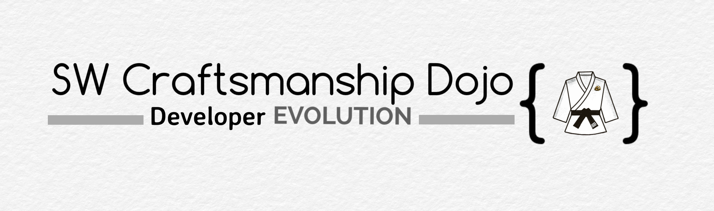

# Michele Brissoni - Technical Lead - SW Craftsmanship Coach 🚀

Welcome to my GitHub space! I'm Michele Brissoni, a passionate advocate for crafting high-performing teams and driving organizational excellence through OKR, Agile, DevOps, and SW Craftsmanship. Let's embark on a journey of evolution together!

## 💡 Who Am I?

- **SW Craftsmanship & Agile/DevOps Coach:** With over 20 years of experience, when I started my adventure in F1, I've been guiding organizations towards elite performance and sustainability.

- **OKR Guru:** I'm a passionate advocate for DevOps and Agile, and I've been helping organizations achieve excellence through OKR.

- **Founder of the [SW Craftsmanship Dojo®](https://swcraftsmanshipdojo.com/):** I pioneered a transformative platform, rooted in behavioral engineering, that accelerates upskill/reskill, fosters technical excellence, and empowers teams to become elite performers.
  

## 📘 What Sets Me Apart

I'm a passionate advocate for continuous learning and improvement, always looking for new ways to elevate teams to elite performance. Here are some of my **key 🔑 differentiators**:

- **SW Craftsmanship Dojo®:** My brainchild, this platform transforms teams into elite performers. It blends the power of OKRs, behavioral psychology, neuroscience, and continuous learning following the centeray way of training of Judo, to create an evolutionary platform for IT organizations blended into gamification and incremental learning.

- **Unlocking Elite Performance:** Through a strategic blend of rigorous data-driven assessments—including the DORA model, DASA Competence model, and Samman Technical Coaching—alongside my proprietary KBI observation platform, I consistently elevate teams from mediocrity to DORA Elite status and beyond.

## 🤝 Let's Collaborate!

Whether you're a startup aiming for excellence or an established organization seeking transformative guidance, I'm here to collaborate. Let's build something amazing together! Reach out for consultations, coaching, or if you're looking for the right path to elite performance.

Contact me on my service page on [LinkedIn](https://www.linkedin.com/services/page/8a8b18320293774816/)

## 📬 Get in Touch

- 💼 **Portfolio:** [michelebrissoni.com](https://undeadgrishnackh.netlify.app/)
- 📇 **LinkedIn:** [michelebrissoni](https://www.linkedin.com/in/michelebrissoni)
- 🥋 **The Dojo:** [SW Craftsmanship Dojo®](https://swcraftsmanshipdojo.com/)
- 👨‍💻 **GitHub:** [undeadgrishnackh](https://github.com/undeadgrishnackh)

Let's craft greatness! 🚀 
Let's FORGE the new generation of Unicorn Companies! 🦄
